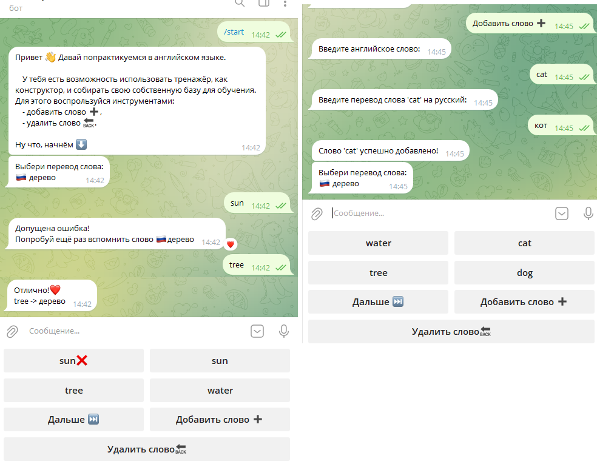

# EnglishBot

EnglishBot — это Telegram-бот для интерактивного изучения английского языка. Тренируйте перевод слов, пополняйте личный словарь и учитесь в удобном формате прямо в мессенджере!

> ⚠️ Это `README.md`, он содержит только краткую информацию. Полная документация, инструкции по установке и руководство пользователя находятся в файле docs/bot_manual.docx.

## Быстрый запуск

Чтобы запустить бота, выполните:

1. **Создайте Telegram-бота в месенджере:**

   ```bash
   найти контакт BotFather и ввести команды /start и /newbot
   ```
2. **Установите зависимости:**

   ```bash
   pip install -r requirements.txt
   ```
3. **Настройте окружение:**
   Создайте файл `.env` и добавьте свои данные:

   ```
   TELEGRAM_TOKEN=<ваш_токен_от_BotFather>
   db_password=<ваш_пароль_от_PostgreSQL>
   ```
4. **Создайте базу данных:**

   ```bash
   python src/db_for_telegram_bot.py 
   ```
5. **Запустите бот:**

   ```bash
   python src/main.py
   ```

## Структура проекта

```tree
EnglishBot/
    ├── src/                       # Исходный код
    │   ├── main.py                    # основной код
    │   └── db_for_telegram_bot.py     # Скрипты для работы с БД 
    ├── docs/                      # Документация проекта
    │   └── bot_manual.docx            # Руководство пользователя
    ├── requirements.txt           # Зависимости Python
    ├── README.md                  # Описание проекта
    ├── .env                       # Конфигурация (не добавлять в Git)
    ├── .gitignore                 # Правила для Git
```

## Скриншот интерфейса


